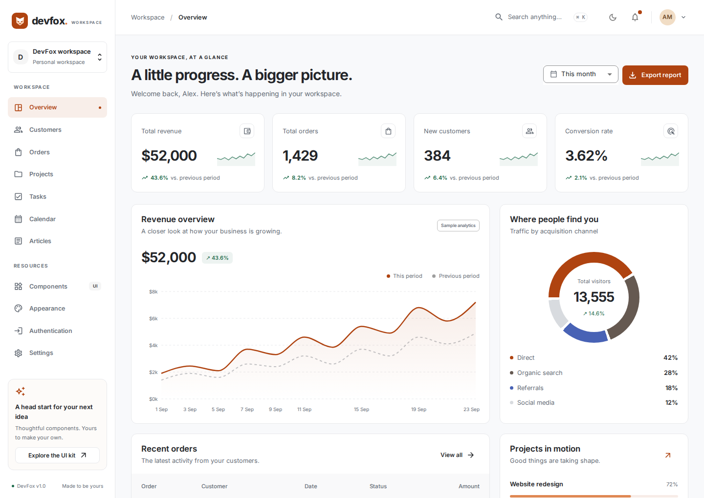
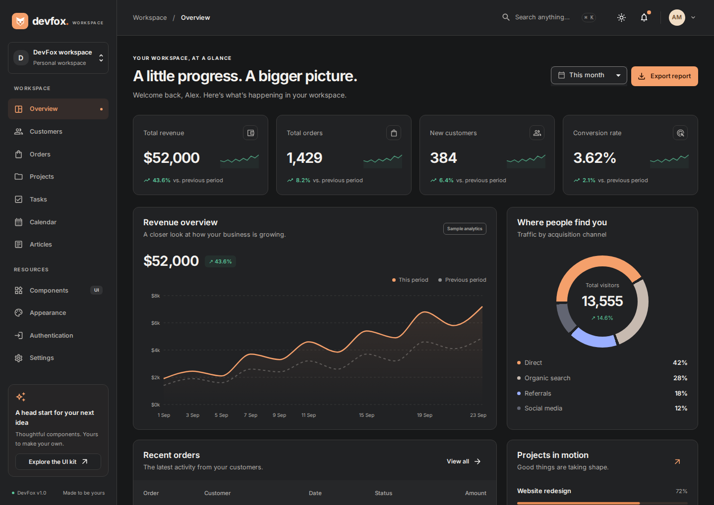
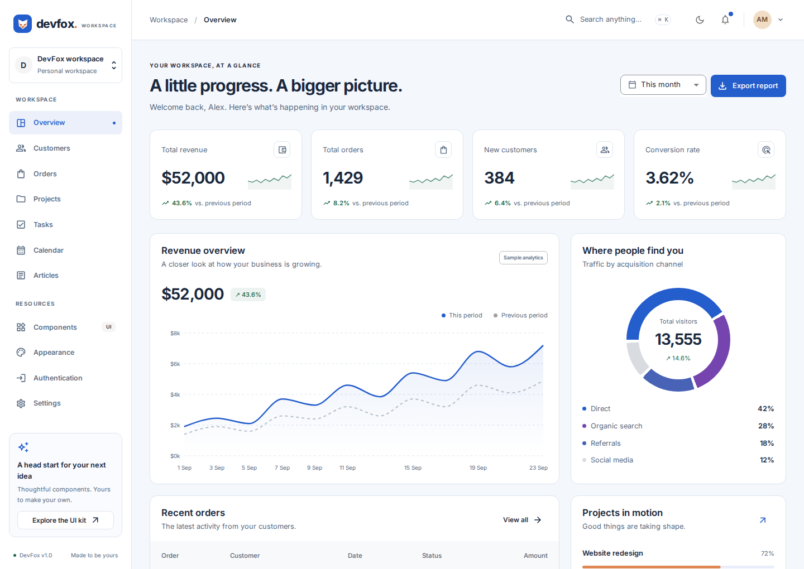
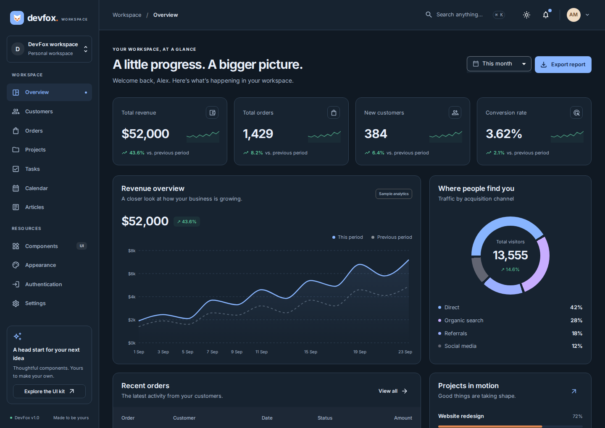
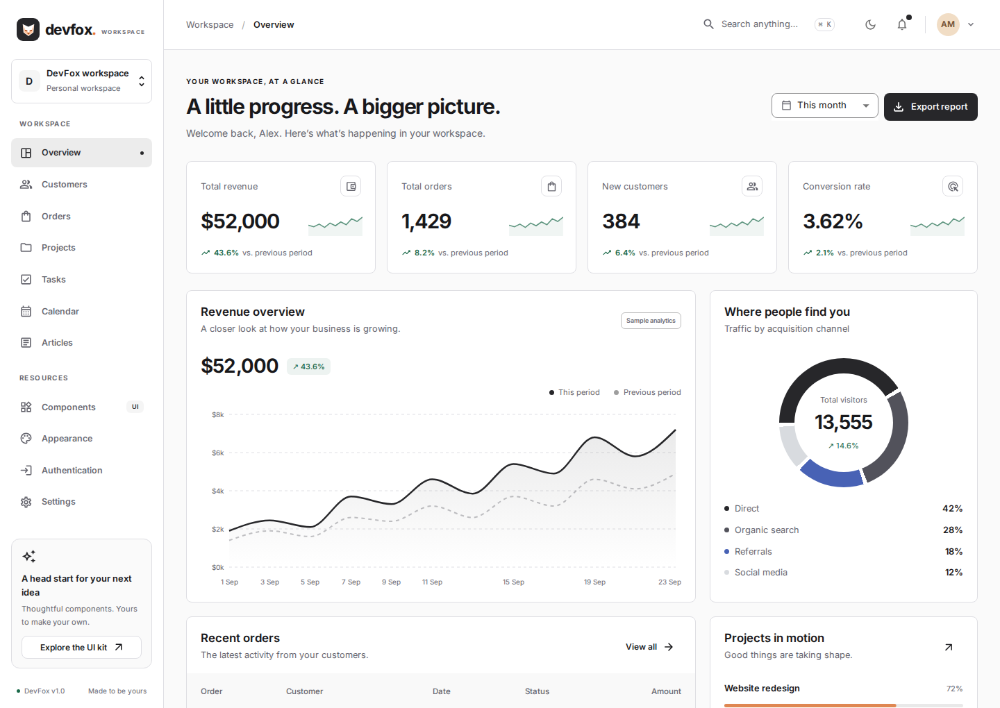
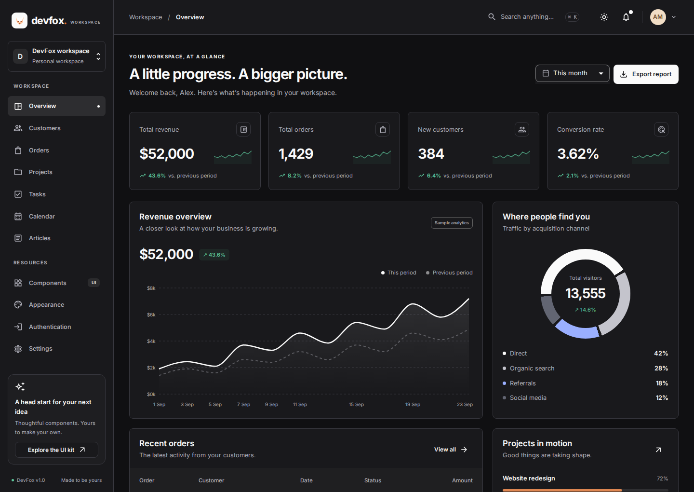
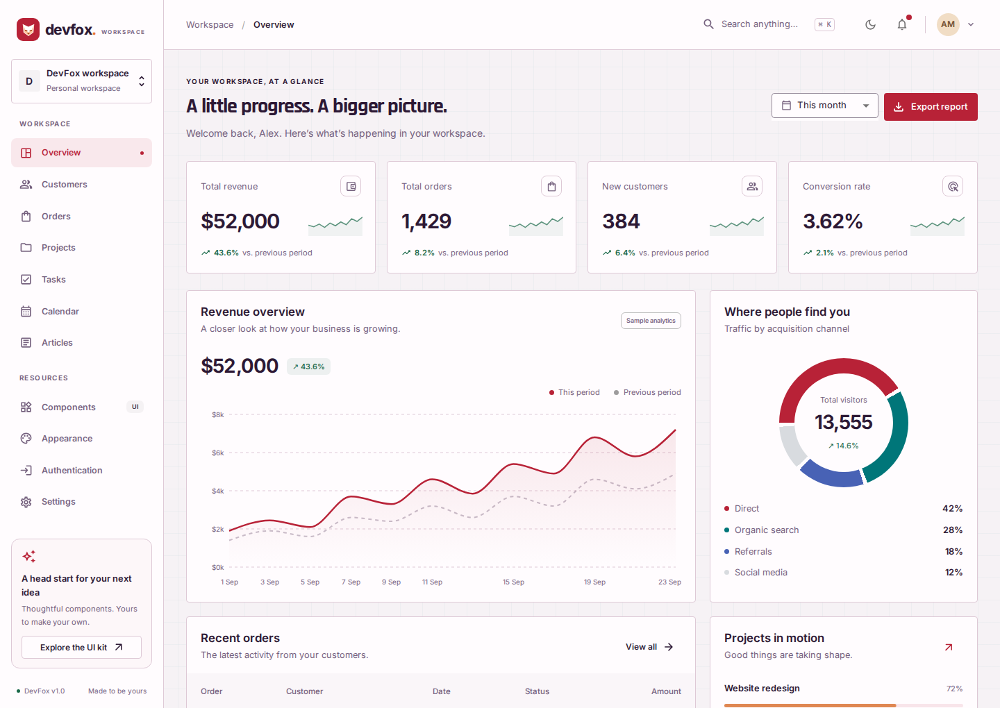
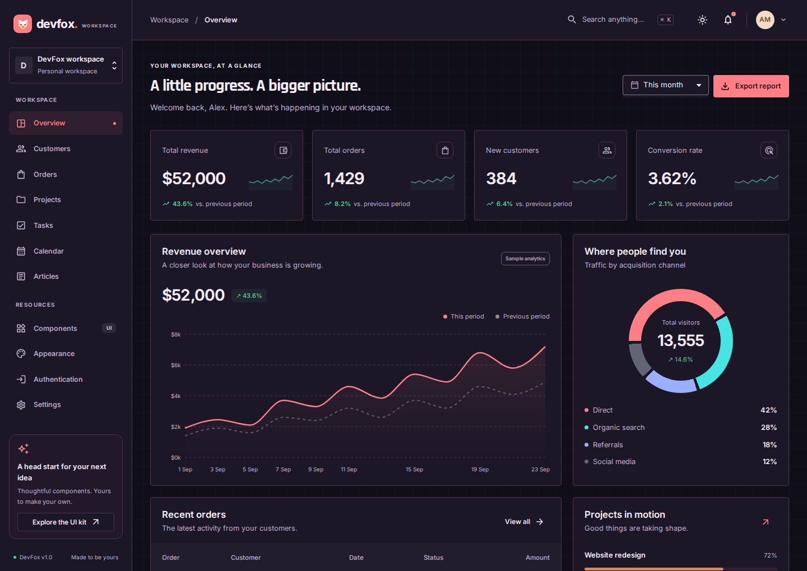

# DevFox UI

A thoughtful React + Material UI dashboard template. Take a component, copy a feature, or use the whole workspace as the beginning of your next product.

**Runs locally. No API keys, account, database, remote fonts, or backend required.**

## Four themes, eight combinations

Every theme includes a light and dark palette. Click any preview to open the full-size screenshot.

| Theme                                                                  | Light                                                                                                                                      | Dark                                                                                                                                    |
| ---------------------------------------------------------------------- | ------------------------------------------------------------------------------------------------------------------------------------------ | --------------------------------------------------------------------------------------------------------------------------------------- |
| **DevFox**<br>Warm terracotta and balanced neutrals<br>`devfox`        | [](docs/images/devfox-light.png)                    | [](docs/images/devfox-dark.png)                    |
| **App**<br>Clear blue and cool surfaces<br>`appTheme`                  | [](docs/images/appTheme-light.png)                   | [](docs/images/appTheme-dark.png)                   |
| **Shad**<br>Monochrome and minimal details<br>`shadTheme`              | [](docs/images/shadTheme-light.png)                | [](docs/images/shadTheme-dark.png)                |
| **Cyberpunk**<br>Coral, cyan, and a technical grid<br>`cyberpunkTheme` | [](docs/images/cyberpunkTheme-light.png) | [](docs/images/cyberpunkTheme-dark.png) |

Choose a theme in **Settings → Appearance**. Colors, surfaces, semantic states, component defaults, and typography share a single theme factory. See the [theme guide](src/theme/README.md) for customization and [theme previews](docs/theme-preview.md) for a dedicated gallery.

## Start here

Use **Node.js 24 LTS** (tested with 24.13.1) and npm. The supported minimum is Node 22.13; `.nvmrc` selects Node 24.

```bash
nvm use                 # optional, if you use nvm
npm ci
npm run dev
```

Open the URL printed by Vite, normally [localhost:5173](http://localhost:5173). The development server listens on all interfaces, so you can also preview it on a phone on your local network.

```bash
npm run build           # type-check and produce dist/
npm run preview         # serve the production build locally
```

## What’s included

| Feature           | What you can do                                                                                 |
| ----------------- | ----------------------------------------------------------------------------------------------- |
| Overview          | Switch reporting periods, inspect revenue, export CSV reports, open recent orders               |
| Customers         | Search, filter, paginate, create, edit, select, export, and delete with confirmation            |
| Orders            | Search by customer/product/ID, filter by payment status, paginate, inspect, and export          |
| Projects          | Create, edit, filter, track progress, and delete projects                                       |
| Tasks             | Add, edit, complete, filter, and delete tasks                                                   |
| Calendar          | Navigate months, select dates, create/edit/delete events, and view a daily agenda               |
| Articles          | Read, search, filter, write, edit, and delete plain-text articles and drafts                    |
| Settings          | Edit a profile, choose a theme, change density, and save notification preferences               |
| Component gallery | Explore interactive controls, feedback, typography, palettes, and reuse examples                |
| Authentication    | Responsive sign-in, registration, and password-reset previews with validation                   |
| App shell         | Mobile drawer, keyboard page search (`⌘/Ctrl K`), notifications, account menu, and theme toggle |

The authentication screens are **UI examples**, not authentication. They never store or send credentials. Orders and analytics are demo data; no payments are processed. Features save changes in this browser, not on a server.

## Built to take apart

```text
src/
  app/                   Application composition: router, navigation, shell, page search
  features/
    customers/           Customer types, demo data, page, and editing dialog
    orders/              Order types, demo data, table, detail dialog, and public exports
    projects/            Project types, demo data, page, and editing dialog
    ...                  Each other feature follows the same pattern
  components/            Shared, prop-driven UI primitives
  hooks/                 Reusable browser-state hook
  lib/                   Formatting, local-date, and CSV utilities
  theme/                 Presets, shared MUI theme factory, and preferences
```

Features do not need a global store, query provider, schema library, or service configuration. A typical feature starts with:

```tsx
const [customers, setCustomers] = useLocalStorage('devfox:customers', initialCustomers);
```

To reuse a piece:

1. Copy the feature directory or shared component you want.
2. Copy its imports from `components/`, `hooks/`, `lib/`, and `theme/`.
3. Wrap your application with the theme provider.
4. Register the page in your router. Replace local demo state with your API when ready.

For complete examples, see [architecture and feature extraction](docs/architecture.md), the [feature guide](src/features/README.md), and the [shared component guide](src/components/README.md).

## Demo data and persistence

Seed data lives alongside each feature in `data.ts`. It is small, typed, and readable. Calendar seeds are relative to the current date so the agenda has useful example events. Analytics are a standalone sample dataset, not an aggregation of the small order fixture.

Edits synchronize between mounted components and browser tabs. If browser storage is blocked, the workspace continues in memory. Data is not shared with other people or devices.

To reset the demo, run this in the browser console and refresh:

```js
Object.keys(localStorage)
  .filter((key) => key.startsWith('devfox:'))
  .forEach((key) => localStorage.removeItem(key));
location.reload();
```

Do not put real credentials or sensitive customer data in this local demo store. See [connecting an API](docs/architecture.md#connecting-an-api) for the integration boundary.

## Checks

```bash
npm run typecheck
npm run lint
npm run format:check
npm test
npx playwright install chromium    # once, for browser tests
npm run test:e2e
```

- Unit tests cover theme contrast, local persistence/synchronization, and calendar boundaries.
- Browser tests exercise CRUD, filtering, export, search, notifications, settings, and mobile layouts.
- Axe checks cover the dashboard and feature pages in all eight theme/mode combinations. Automated checks complement manual visual and keyboard review; they do not certify every possible interaction state.
- Playwright writes screenshots, traces, and an HTML report into ignored test directories.

See the [verification record](docs/verification.md) for tested versions and coverage.

## Stack and upgrades

React 19, Material UI 9, React Router 7, Recharts 3, Vite 8, and TypeScript 6. Inter and Rajdhani are bundled locally. Exact versions are recorded in `package-lock.json`.

Dependencies were resolved against the npm registry on **8 September 2026**. Two intentional compatibility limits:

- **TypeScript 6.0.x:** the latest `typescript-eslint` supports TypeScript below 6.1; TypeScript 7 cannot currently be combined with that supported parser range.
- **jsdom 29.x:** jsdom 30 requires a newer Node patch than the workspace’s Node 24.13.1. The current 29.x release supports this runtime.

Unused dependencies and the unconfigured legacy Storybook setup were removed. The in-app component gallery replaces the old static documentation examples. See [modernization tasks](docs/modernization.md) for the delivery breakdown.

When upgrading again, check peer dependencies instead of using `--force` or `--legacy-peer-deps`, then run the checks above.

## Deploy

Build and host `dist/` on a static host. Configure an **SPA fallback to `/index.html`** for URLs that do not correspond to files; otherwise directly opening `/projects` or refreshing `/settings` will return a server 404.

The default deployment target is the domain root. To deploy under a subdirectory, set both Vite’s `base` in `vite.config.ts` and React Router’s `basename` in `src/app/router.tsx` to the same prefix, and adjust the host fallback accordingly.

There are no required environment variables, analytics services, or outgoing API calls. Old template URLs redirect to their closest new feature; new projects should use the routes in `src/app/navigation.ts`.

## License and author

[MIT](LICENSE). Free for personal and commercial use; retain the license notice when distributing the source.

Created by [pbasiak](https://github.com/pbasiak). If the template saves you time, a star on the repository is appreciated.
